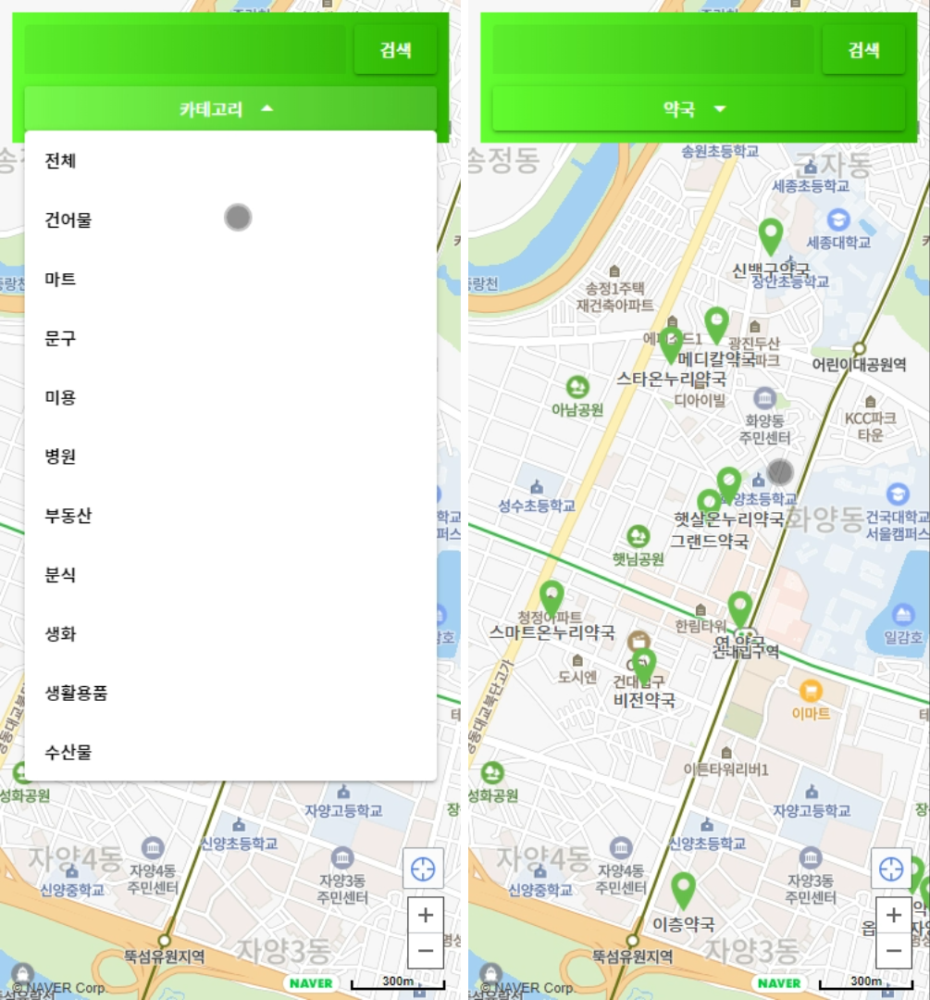

# Paymap Frontend
> 사용자 친화적 제로페이 가맹점 지도 서비스

![NPM Version][npm-image]
![version]

제로페이 가맹점 데이터를 정렬하여, 사용자 친화적으로 보여주는 지도 서비스 입니다.


## 사용 예제 및 주요 기능



- 제로페이 가맹점 카테고리별 분류 기능
- 가맹점 검색 기능


## 개발 환경 설정

### 환경 설정 및 개발 커맨드
```bash
npm install

quasar dev
```

### 배포용 빌드 커맨드
```bash
quasar build
```


## 팀원 정보

### [Moonjuhan](https://github.com/MoonJuhan)
Frontend Developer

### [Seongbum Seo](https://github.com/seongbuming)
Frontend Developer

[npm-image]: https://img.shields.io/npm/v/datadog-metrics.svg?style=flat-square
[npm-url]: https://npmjs.org/package/datadog-metrics
[version]: https://img.shields.io/badge/version-v1.0.11-blue

